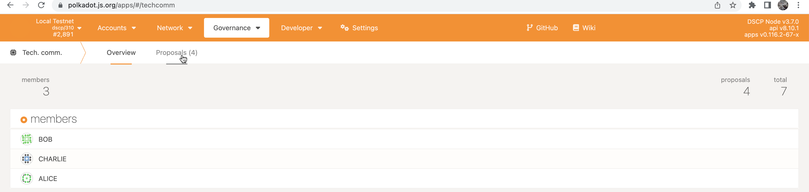
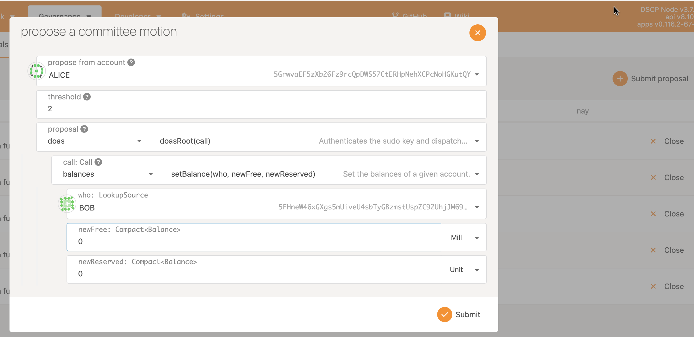
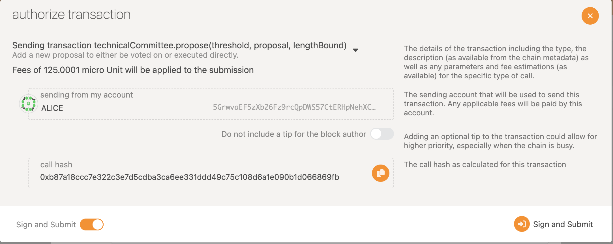
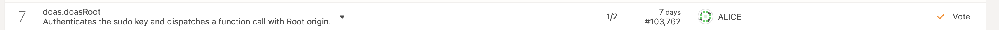
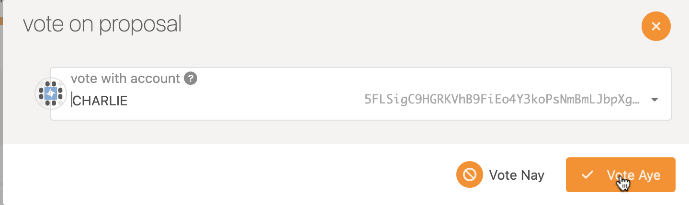
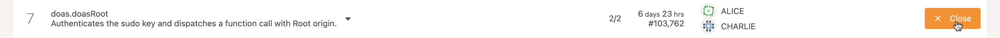
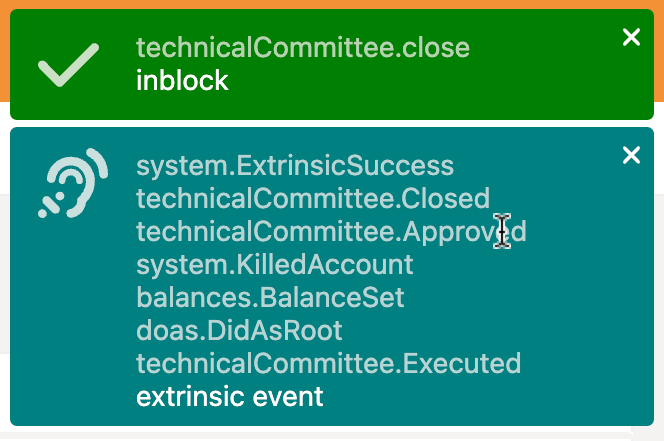
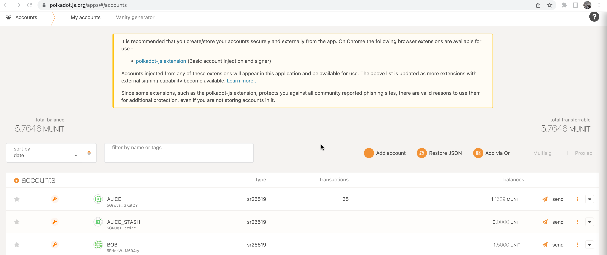
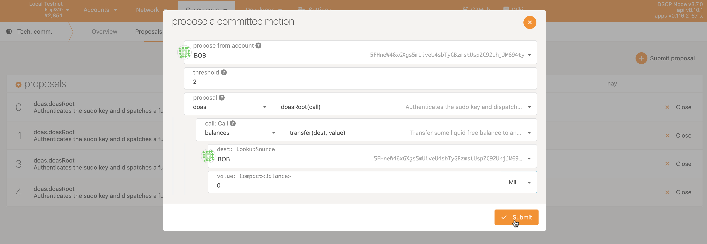
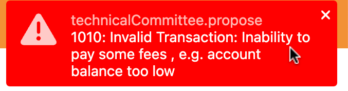

# Governance

This contains information about some of the governance procedures that take place in the Node. Initially this covers the voting process

## Create a Vote

In order to create a vote, in the Polkadot JS Apps frontend select the Governance tab, then `Tech. Comm`. You will then be presented with a screen with the current Governance members.

In order to start a new vote select proposals.

On the proposal screen select submit proposal on the right hand side. This will bring up a new proposal which must be made from an initial account, for example, here Alice is creating a proposal. You may notice the use of the doAs pallet, for more information visit [the readme](README.md) on how it works.

Once the proposal has been agreed and submit has been clicked another window will appear to confirm the transaction.

Click sign and submit. There wiill then be a voting round.

Once the voting round has been completed the proposal needs to be closed to enter the chain.

You should see these for a successful vote.

## Set Balance to 0

As we can see in the image below, Bob has nearly the same balance as Alice.

By following the voting rules above we can chance a users balance to 0.

## Can no longer transact

Now Bob has a balance of 0, if that party tries to create a proposal it will fail.

This error appears in the right had side indicating that the use is not able to create a transaction.

